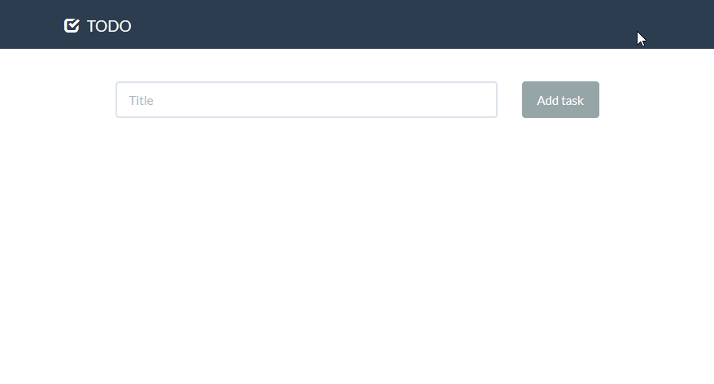

# todo-kiss
todo-kiss is a simple self-hosted todo manager script with PHP and sqlite. "Kiss" (Keep It Simple, Stupid) here is used to emphasize the minimalism of the app. 

This project is inspired by [`prologic/todo`](https://github.com/prologic/todo), written in Go.

The default theme is [Flatly](https://bootswatch.com/3/flatly/) from Bootswatch. You can change the theme or use a customized one simply by replacing the *assets/css/bootstrap.min.css* file.
